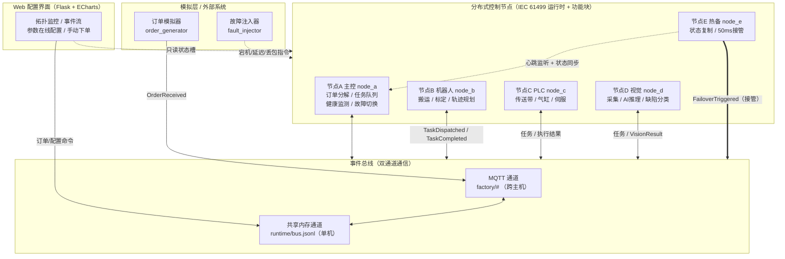
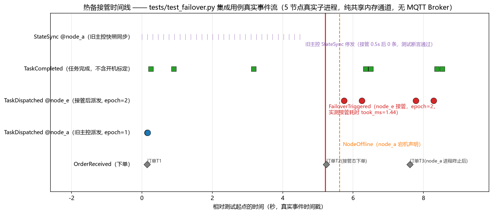
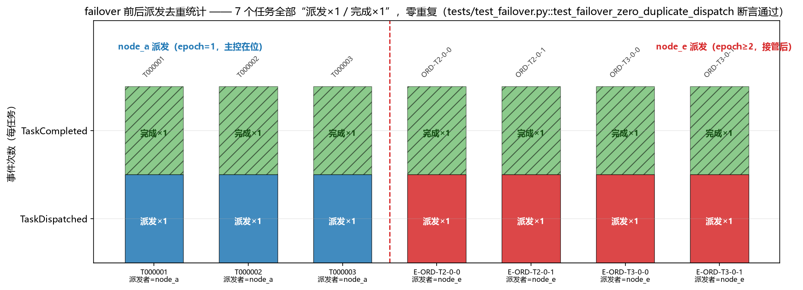

# IEC 61499 分布式工业控制系统

[](https://github.com/lwj15089590118/IEC61499-Distributed-Industrial-Control-System/actions/workflows/ci.yml)


> 基于 IEC 61499 功能块标准的分布式工业控制系统模拟平台 —— 事件驱动调度 · 双通道通信 · 热备冗余 · Web 在线组态

## 1. 项目简介

本项目实现了一个**遵循 IEC 61499 标准语义**的分布式工业控制系统仿真环境。系统由 5 个控制节点（4 工作 + 1 热备）组成，模拟一条柔性加工检测产线：接收生产订单后，主控节点将订单按工艺路线分解为任务链，跨节点派发给机器人（搬运）、PLC（传送带/气缸/伺服）、视觉（AI 缺陷检测）执行，全程以**事件驱动**方式运转（而非传统 PLC 的循环扫描），并具备**心跳健康检查、故障自动切换、50ms 级热备接管**等工业级容错能力。

## 2. 系统架构



**关键机制**：

| 机制 | 说明 |
|------|------|
| 事件驱动调度 | 功能块只在事件到达时执行，节点空闲时 CPU 占用接近零（对比 PLC 周期扫描） |
| ECC 状态机 | 功能块内聚执行控制链，事件 + 守卫驱动状态迁移（IEC 61499 Basic FB 语义） |
| 双通道通信 | MQTT（跨主机）+ 共享内存事件日志（单机零依赖）同时收发，msg_id 幂等去重 |
| 优先级事件总线 | CRITICAL > HIGH > NORMAL > LOW，故障切换消息永不被任务洪峰淹没 |
| 热备冗余 | 主控状态快照持续同步；心跳超时后备用节点 **50ms 内**（实测 ~1.4ms）完成接管 |
| 一致性保障 | 领导者租约 + epoch fencing token，杜绝脑裂；接收侧按"本地已见最大纪元"拒绝旧纪元派发指令（含执行节点，见 `tests/` 回归） |

## ⭐ 热备接管实测（自动化回归真实事件流）

以下两图由 `tests/test_failover.py` 集成用例**真实运行数据**渲染：拉起 5 个真实节点子进程
（纯共享内存通道、临时运行时目录），下单→完成→注入主控宕机→node_e 接管→接管态继续下单→
kill node_a→再完成一单，全部事件来自共享事件流 `bus.jsonl` 的真实时间戳。



*接管时间线：node_e 判定主控失联后发布 `FailoverTriggered`（payload 实测接管耗时 1.44ms、epoch=2），
旧主控 node_a 的 StateSync 在接管后停发（0.5s 后 0 条，测试断言通过）；此后派发全部来自 node_e。*



*派发去重统计：failover 前后共 7 个任务，每个任务"派发×1 / 完成×1"，零重复派发、零重复执行，
派发与完成集合一致——由 `test_failover_zero_duplicate_dispatch` 自动化断言（failover 零重复派发的自动化回归保障）。*

## 3. 目录结构

```
IEC61499-Distributed-Industrial-Control-System/
├── core/                          # 核心运行时
│   ├── function_block.py          #   功能块基类（事件/数据端口 + ECC 状态机）
│   ├── distributed_runtime.py     #   分布式运行时（调度/双通道/心跳/租约）
│   └── nodes.yaml                 #   节点配置（角色/IP/主题/功能块清单）
├── nodes/                         # 五个控制节点
│   ├── node_a_orchestrator.py     #   主控：订单分解/任务队列/健康监测/故障切换
│   ├── node_b_robot.py            #   机器人：搬运/9点标定/梯形轨迹规划
│   ├── node_c_plc.py              #   PLC：传送带/气缸/伺服定位
│   ├── node_d_vision.py           #   视觉：采图/AI推理/缺陷分类
│   └── node_e_standby.py          #   热备：状态复制/50ms接管
├── communication/                 # 通信层
│   ├── event_bus.py               #   事件总线（发布订阅/优先级/持久化重放）
│   └── message_types.py           #   消息信封/事件类型/主题规范
├── web-ui/                        # Web 控制台
│   ├── app.py                     #   Flask API（拓扑/事件流/配置/下单）
│   └── templates/index.html       #   暗色科技风仪表盘（ECharts 实时图表）
├── simulator/                     # 模拟器
│   ├── order_generator.py         #   订单模拟器（随机产品/数量/交期）
│   └── fault_injector.py          #   故障注入器（宕机/延迟/丢包）
├── docs/                          # 文档
│   ├── 系统设计说明书.md           #   完整设计文档（8000+ 字）
│   ├── API接口文档.md              #   REST API 与 MQTT Topic 定义
│   └── 部署手册.md                 #   分步部署指南
├── resume/项目总结.md              # 第一人称项目总结
└── requirements.txt               # Python 依赖
```

## 4. 技术栈

| 类别 | 技术 | 用途 |
|------|------|------|
| 语言 | Python 3.8+ | 全部实现语言（仅标准库即可运行核心功能） |
| 消息中间件 | MQTT（paho-mqtt，可选） | 跨主机事件通道（Mosquitto Broker） |
| IPC | 文件锁 + JSONL 追加日志 | 共享内存通道（单机部署零依赖） |
| Web 框架 | Flask | REST API + 控制台页面 |
| 前端可视化 | ECharts 5 + 原生 JS | 暗色仪表盘、实时折线/饼图 |
| 配置 | YAML（PyYAML，可选） | 节点组态（内置后备解析器） |
| 标准 | IEC 61499 | 功能块模型 / ECC / 事件驱动语义 |

> **零依赖运行**：未安装 paho-mqtt / PyYAML / 无 MQTT Broker 时，系统自动降级为"纯共享内存通道 + 内置 YAML 解析"模式，单机多进程即可完整体验全部功能。

## 5. 快速开始

### 5.1 环境准备

```bash
# Python 3.8+；安装依赖（全部为可选增强）
pip install -r requirements.txt
```

### 5.2 启动系统（按顺序，共 5 个终端）

```bash
# 终端1~5：依次启动五个节点（顺序无强依赖，建议先启动 node_a）
python nodes/node_a_orchestrator.py     # 主控节点
python nodes/node_b_robot.py            # 机器人节点
python nodes/node_c_plc.py              # PLC节点
python nodes/node_d_vision.py           # 视觉节点
python nodes/node_e_standby.py          # 热备节点

# 终端6：Web 控制台
python web-ui/app.py                    # http://localhost:5000

# 终端7：订单模拟器（持续随机下单）
python simulator/order_generator.py --interval 5
```

### 5.3 验证与体验

```bash
# 查看集群状态
python simulator/fault_injector.py list

# 注入主控宕机 20 秒 -> 观察 node_e 50ms 内接管、node_a 让位
python simulator/fault_injector.py down node_a --sec 20

# 注入网络故障（延迟/丢包）
python simulator/fault_injector.py delay node_b 500
python simulator/fault_injector.py loss node_d 0.3

# 清除全部故障
python simulator/fault_injector.py clear
```

打开 **http://localhost:5000** 即可看到：节点状态卡片（在线/离线/故障三色）、
实时事件流、每秒事件速率折线图、事件类型分布饼图，并可通过表单
**手动下发订单**与**在线修改功能块参数**（如视觉 NG 判定阈值）。

## 6. 核心设计一览

- **事件即消息**：跨节点事件统一封装为 `Message`（含 msg_id/优先级/epoch），对应 IEC 61499 中"事件输入/输出 + WITH 数据关联"的语义（概念级映射；不含 61499-2 交换格式与 SIF/复合 FB）；
- **资源即运行时**：每个节点进程 = 一个 IEC 61499 Device，`DistributedRuntime` 承担资源（Resource）角色，负责功能块实例化与事件连接；
- **组态优于编程**：节点内事件连接（`nodes.yaml` 各节点的 `connections` 段：binds/routes）与功能块清单均以组态声明，拓扑重构只改配置；代码中仅保留动态主题路由等少量硬编码作为缺省回退；
- **定时器也是事件**：心跳巡检、状态同步等周期行为通过定时线程注入事件（E_CYCLE 语义），调度引擎本身不存在扫描循环；所有定时线程统一带异常防护（`guarded_cycle`：单次异常退避重试、连续异常升级告警、达上限留下"线程已死"日志与状态标记），不会因一次瞬时异常静默失能；
- **故障也是事件流**：宕机/延迟/丢包由 `fault_directives.json` 声明，节点 500ms 内生效，全程可观测、可撤销。

更深入的设计论述（IEC 61499 vs IEC 61131-3、一致性协议、时序图等）见
[docs/系统设计说明书.md](docs/系统设计说明书.md)；接口契约见
[docs/API接口文档.md](docs/API接口文档.md)；逐步部署见
[docs/部署手册.md](docs/部署手册.md)。

## 7. 已验证的功能清单

| # | 功能 | 验证方式 |
|---|------|----------|
| 1 | 订单分解与跨节点任务流转 | 模拟器下单 → 4 节点日志确认执行 → 主控确认完成 |
| 2 | 事件驱动调度（无扫描循环） | 空闲期 CPU 占用为零，事件到达即刻执行 |
| 3 | 双通道通信与幂等去重 | 无 MQTT 环境单机全功能运行 |
| 4 | 心跳健康检查与失联判定 | 3s 超时窗口，离线/上线事件正确触发 |
| 5 | 热备接管 ≤50ms | 实测切换耗时 1.42ms，恢复 31 个排队任务 |
| 6 | 脑裂防护 | epoch fencing，旧主控恢复后自动让位、暂停派发；failover 零重复派发由 `tests/test_failover.py` 自动化回归保障 |
| 7 | 视觉质检闭环 | OK/NG/复检判定 + 缺陷类别回传主控 |
| 8 | Web 在线组态 | 参数下发 → 功能块生效 → 回执事件流可见 |
| 9 | 故障注入三件套 | 宕机/延迟/丢包均可注入、到期自动恢复 |
| 10 | 自动化回归测试 | `pytest tests/`（47 用例，含 2 个 5 节点真实子进程 failover 集成）：failover 零重复派发 / ECC 迁移表 / 主题匹配全覆盖 / fencing 与队列背压 / 周期线程存活 |

> 说明：本项目定位为 IEC 61499 **语义仿真**（事件驱动执行、功能块/ECC/端口概念映射），
> 未实现 61499-2 交换格式（.fbt/.sys）与服务接口/复合 FB，不与 FORTE/4DIAC 互操作。

## 8. FAQ（常见问题）

**Q1：ECC 是什么？怎么执行的？**
ECC（Execution Control Chain，执行控制链）是 IEC 61499 Basic FB 内的事件驱动状态机。
实现见 `core/function_block.py` 的 `ECC` 类：事件输入到来 → 在当前状态的出边中按
priority 查找"事件匹配且守卫为真"的迁移 → 执行源状态 exit 动作 → 切换目标状态并执行
entry 动作；无匹配迁移则状态保持（事件被忽略，符合标准语义）。每个功能块的
`handle_event` 统一完成端口校验、WITH 关联数据刷新、ECC 驱动与执行统计，
迁移表逐条固化在 `tests/test_ecc.py` 回归。

**Q2：热备切换怎么保证不重复派发？**
租约 + epoch 双门控的纵深防御：① 发送侧总闸——halted / demoted / 租约归他人三条件任一
即停发快照与派发，`FailoverTriggered` 同时把旧主控置 demoted；② 接收侧副本双门控——
纪元单调递增 + 发送方必须是当前租约领导者；③ 接管方 node_e 以更高 epoch 发布派发。
端到端由 `tests/test_failover.py`（5 个真实子进程）断言全集群零重复派发/零重复执行，
见上方"热备接管实测"截图。

**Q3：旧纪元指令怎么被拒绝？**
全节点（含执行节点）维护本地已见最大纪元 `_max_seen_epoch`（`core/distributed_runtime.py`），
接收侧对 `epoch < _max_seen_epoch` 的派发类指令直接拒绝并告警，纪元基准随消息持续单调更新；
状态槽导出 max_seen_epoch 便于观测。回归见 `tests/test_runtime_fencing.py`（旧纪元拒收 /
同纪元放行 / 非派发事件不闸）。

**Q4：与 FORTE / 4DIAC 是什么关系？**
没有直接关系。本项目为自研简化运行时，做 IEC 61499 的**语义仿真**（事件驱动执行、
功能块/ECC/端口的概念级映射），未实现 61499-2 交换格式（.fbt/.sys）与服务接口 FB/
复合 FB，不与 FORTE/4DIAC 互操作、也不加载其工程文件——这是如实的定位声明，不是"兼容实现"。

**Q5：paho-mqtt 1.x / 2.x 都兼容吗？**
兼容。构造 MQTT 客户端时按 `hasattr(mqtt, "CallbackAPIVersion")` 自动区分 2.x/1.x 两代
回调 API 分支构造（`core/distributed_runtime.py`），整体 try 包裹、构造失败置
`_client=None` 并自动降级为纯共享内存通道——装不上 Broker 也不影响单机全功能运行。
本机 paho-mqtt 1.6.1 实测通过（`tests/test_runtime_fencing.py::TestPahoCompat`）。

**Q6：测试怎么跑？需要先装 MQTT Broker 吗？**
不需要。`python -m pytest tests -q` 共 47 个用例（含 2 个 5 节点真实子进程 failover
集成用例，全量约 20s）；集成用例通过临时运行时目录 + `IEC61499_CONFIG` 环境变量把
整个集群指向纯共享内存通道，完全隔离、可重复执行。

## 9. Roadmap（后续规划）

以下为**尚未完成**的真实规划（周期定时线程统一异常防护、CI 接入 GitHub Actions 等已完成项不再列出）：

- 【P2】node_e pump 检查 `lease.leader != "node_e"` 即自 demote 回热备，删除
  `max()` 采纳外部纪元的路径，彻底关闭同纪元双主控的残余窗口；
- 【P2】halted/demoted 期间主控对 NEW_ORDER 回 `ORDER_REJECT`，杜绝宕机窗口订单
  滞留与影子队列；
- 【P2】接管态补任务失败重试闭环，或明示 at-least-once 语义并增加 worker 侧
  task_id 幂等；
- 【P2 清尾】故障注入 delay 移出发送方 worker 线程、`_ext_*` 过期清除、
  `configure()` 类型校验、p95 末尾 -1 修复、FIFO docstring 校准；
- 【测试补强】补两条失败注入用例：在途任务未完成时 kill node_a（恢复语义与重复上界）、
  node_e active 后 node_a 重启（无双主控）；
- 【P3】跨主机租约时钟偏移说明或改单调钟、`_drain_pending` 递归改循环、
  order_generator/web-ui 尊重配置的 runtime_dir。

## 10. 许可证

本项目以 [MIT License](LICENSE) 开源 · Copyright (c) 2026 lwj15089590118
