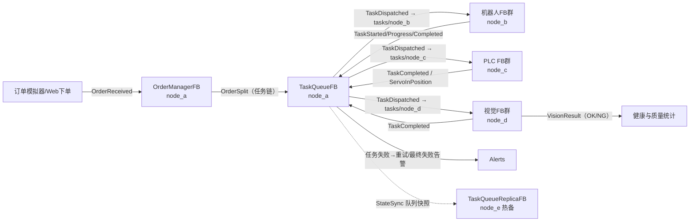
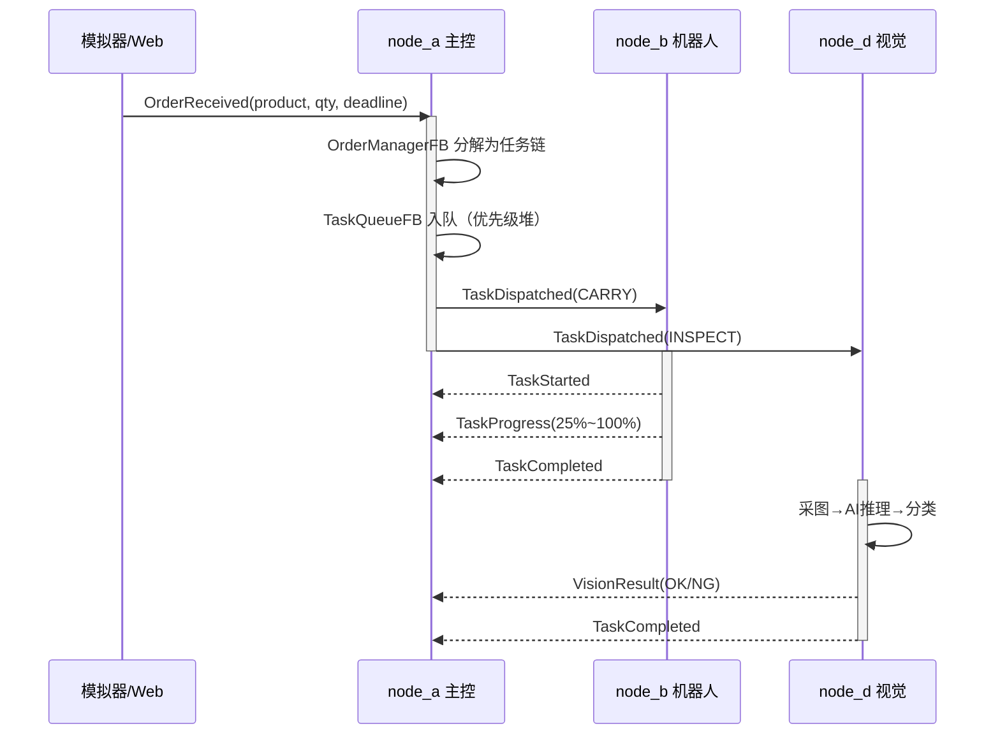
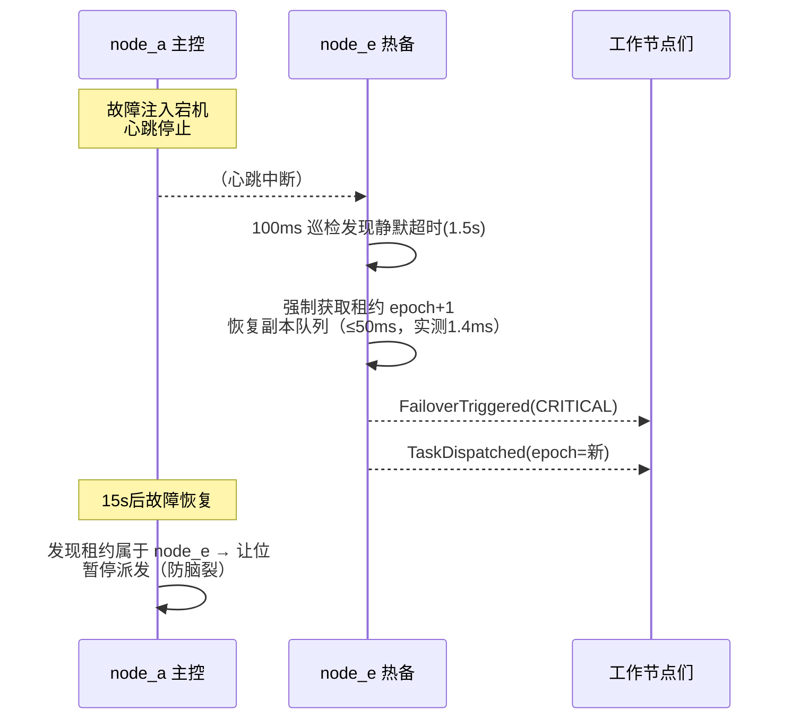

# 系统设计说明书

**项目名称**：IEC 61499 分布式工业控制系统（IEC 61499 Distributed Industrial Control System）
**版本**：v1.0.0
**文档定位**：完整阐述本系统的标准依据、架构决策、核心机制与运维方案，供开发、测试与运维人员理解系统全貌。

---

## 目录

1. [IEC 61499 标准核心概念介绍](#1-iec-61499-标准核心概念介绍)
2. [与传统 PLC（IEC 61131-3）的对比分析](#2-与传统-plciec-61131-3的对比分析)
3. [系统总体架构设计](#3-系统总体架构设计)
4. [事件驱动机制详解](#4-事件驱动机制详解)
5. [分布式一致性协议说明](#5-分布式一致性协议说明)
6. [热备冗余方案设计](#6-热备冗余方案设计)
7. [部署与运维方案](#7-部署与运维方案)

---

## 1. IEC 61499 标准核心概念介绍

### 1.1 标准背景

IEC 61499 是国际电工委员会发布的《工业过程测量与控制系统用功能块》标准，首版于 2005 年，2013 年发布第二版。它以 IEC 61131-3 的功能块概念为起点，针对**分布式智能控制系统**的需求重新设计，被广泛认为是下一代工业控制软件体系结构的基础标准，也是工业 4.0、分布式智能制造语境下的重要技术支柱。

传统控制系统采用"集中式 PLC + 现场总线 IO"的层级结构，控制逻辑集中在控制器中循环扫描执行。随着产线智能化程度提升，感知、决策、执行逐渐下沉到网络边缘的各类智能设备，系统从"单控制器"演变为"设备网络协同"。IEC 61499 正是为这种"控制即网络"的形态而生的建模标准。

### 1.2 功能块（Function Block）

功能块是 IEC 61499 的基本构建单元。一个功能块由**接口**与**实现**两部分构成：

- **接口**：包括事件输入/输出（EVENT INPUT/OUTPUT）与数据输入/输出（DATA INPUT/OUTPUT）四组端口。事件端口负责触发，数据端口承载信息；
- **WITH 关联**：每个事件端口可以通过 WITH 关联绑定若干数据端口，声明"该事件发生时应随行传输哪些数据"。这使得事件与数据的耦合关系显式化、可组态；
- **实现**：基本功能块（Basic FB）内含算法（Algorithm）与执行控制链（ECC）；服务接口功能块（Service Interface FB）用于封装通信、IO 等与硬件/系统交互的能力；复合功能块（Composite FB）则由其他功能块互连组成。

本系统 `core/function_block.py` 中的 `FunctionBlock` 基类完整实现了上述接口模型：`EventPort`（含 `with_inputs`/`with_outputs`）、`DataPort`（含类型与初始值）、以及子类可声明的 ECC。

### 1.3 执行控制链（ECC，Execution Control Chart）

ECC 是基本功能块内部的状态机，由**状态**（含 entry/exit 动作）与**迁移**（事件条件 + 布尔守卫 guard，带优先级排序）构成。其执行序列为：

```
事件输入到达
  → 在当前状态的出边中按优先级查找 [事件匹配 且 守卫为真] 的迁移
  → 执行当前状态 exit 动作
  → 切换状态，执行新状态 entry 动作
  → entry 动作内可调用算法并发出事件输出
若无可行迁移，事件被忽略（状态保持）
```

ECC 将"何时执行算法"与"算法做什么"分离，使控制流程可视化、可验证。本系统的订单分解（`OrderManagerFB`：Idle↔Splitting）、机器人搬运（`MaterialHandlingFB`：Idle→Moving→Placing→Idle）、伺服定位（`ServoPositionFB`：Standby→Moving→Settled→Standby）等均以 ECC 建模。

### 1.4 应用、资源与设备

IEC 61499 定义了自底向上的四层 containment 结构：

- **设备（Device）**：物理或逻辑的智能单元（对应本系统的一个节点进程）；
- **资源（Resource）**：设备内的执行环境，承担功能块的实例化、事件连接与调度（对应本系统的 `DistributedRuntime`）；
- **应用（Application）**：跨设备分布的功能块网络及其事件/数据连接（对应"订单→搬运→检测"的任务链拓扑）；
- **系统（System）**：设备间通过通信功能块互连形成的整体（对应本项目的五节点集群）。

这一"应用与硬件解耦"的模型使得同一控制逻辑可以重新映射到不同硬件拓扑，这正是分布式系统组态（Configuration）与重配置（Reconfiguration）的基础。本系统通过 `core/nodes.yaml` 声明节点-功能块映射，体现了组态思想。

### 1.5 事件驱动语义与分布

IEC 61499 明确规定功能块的执行**只能由事件触发**，数据本身不触发执行。事件可以在功能块间、资源间、设备间传递，从而把"控制流"扩展到整个分布式系统。本系统把跨节点事件统一封装为 `Message` 信封（`communication/message_types.py`），通过事件总线（`communication/event_bus.py`）与双通道（MQTT / 共享内存）实现事件的分布式流转，是对该语义的直接工程化。

---

## 2. 与传统 PLC（IEC 61131-3）的对比分析

### 2.1 执行模型：事件驱动 vs 周期扫描

IEC 61131-3 的运行模型是**扫描循环**：PLC 周而复始地"读输入 → 执行程序 → 写输出"，典型扫描周期 1~10ms。程序内的逻辑（梯形图/ST）默认"每个周期都看一遍"。这种模型简单确定，但存在固有代价：

- 无论有没有事情发生，CPU 都在满负荷扫描，能耗与算力浪费随程序规模增长；
- 逻辑的正确性隐式依赖周期时序（如自锁、微分指令），事件跨越多个周期的行为难以推理；
- 控制器间协作只能靠轮询共享数据区，缺乏显式的跨控制器因果链。

IEC 61499 采用**事件驱动**：功能块平时静默，事件到达才执行。响应延迟由事件传播链决定而非扫描周期叠加；空闲期资源占用趋近于零；跨节点的事件连接显式表达了因果关系。本系统的调度引擎（`SchedulerEngine`）中不存在任何扫描循环——节点主线程只做保活，全部业务由事件回调推进，周期行为（心跳、巡检）以定时器事件注入实现，等价于标准中的 E_CYCLE/E_DELAY 功能块。

### 2.2 分布能力

| 维度 | IEC 61131-3 | IEC 61499 |
|------|-------------|-----------|
| 部署单元 | 单一 PLC 程序，多控制器需人工分工 | 应用可跨设备分布，功能块网络即控制逻辑 |
| 控制器间交互 | 数据共享区 / 轮询 | 显式事件连接，因果可追溯 |
| 在线重构 | 受限（在线修改有严格约束） | 设计目标即支持重配置 |
| 硬件相关性 | 程序与 PLC 型号强绑定 | 应用与设备映射分离 |

### 2.3 本项目中的对照实现

为了让对比落地，本项目刻意让两类范式并存于同一系统：

- **node_c（PLC 节点）**模拟传统控制对象（传送带/气缸/伺服），但用事件驱动方式实现：传送带位置采用"事件到来时按物理方程惰性求值"，而非每周期刷新，对比效果直观；
- **node_a（主控）**的订单分解-任务派发-结果回收是典型的分布式事件流协作，任何一台工作节点失联，事件流自动改道（任务回收重派），无需人工重新编程。

### 2.4 取舍说明

事件驱动并非无代价：确定性与可预测性分析更复杂，事件风暴需要优先级与背压机制抑制。本系统的应对是：四级消息优先级 + 优先级队列调度 + 队列超限丢低保高策略（见 4.3 节），以及消息幂等去重（见 5.2 节）。

---

## 3. 系统总体架构设计

### 3.1 分层视图

系统自上而下分为四层：

1. **模拟/HMI 层**：订单模拟器、故障注入器、Web 控制台（人机接口与外部系统角色）；
2. **通信层**：事件总线 + MQTT 通道 + 共享内存通道（`communication/` 包）；
3. **运行时层**：分布式运行时（功能块容器、调度引擎、心跳、租约、故障指令）（`core/distributed_runtime.py`）；
4. **应用层**：五个节点上共计 15 个业务功能块（订单管理、搬运、标定、轨迹、传送带、气缸、伺服、采图、推理、分类、热备监视、队列副本等）。

### 3.2 数据流图（订单全生命周期）



### 3.3 任务派发时序图（正常路径）



### 3.4 热备接管时序图（故障路径）



### 3.5 节点内事件连接（以 node_a 为例）

节点内部的功能块互连同样走事件总线，只是消息 scope=local 不出网：

```
factory/orders ──────┐
factory/web/orders ──┴─▶ OrderManagerFB.NEW_ORDER
OrderManagerFB.ORDER_SPLIT ─(local)─▶ TaskQueueFB.ENQUEUE
TaskQueueFB.TASK_DISPATCHED ─(动态主题)─▶ factory/tasks/<target_node>
factory/events ─(类型过滤)─▶ TaskQueueFB.TASK_RESULT
factory/heartbeat/+ ─▶ HealthMonitorFB.BEAT
HealthMonitorFB.NODE_OFFLINE ─┬─(global)─▶ factory/alerts
                              └─(local)──▶ TaskQueueFB.NODE_DOWN + FailoverControllerFB
FailoverControllerFB.REQUEUE ─(local)─▶ TaskQueueFB.REQUEUE
```

这正对应 IEC 61499 应用中"事件连接线"的概念——本系统的 `bind_input` / `route_output` 即事件连接的编程接口，且支持在 `core/nodes.yaml` 各节点的 `connections` 段（binds/routes）中以组态方式声明，代码中的硬编码连接仅作为配置缺省时的回退。

---

## 4. 事件驱动机制详解

### 4.1 事件信封与路由

所有跨节点事件统一封装为 `Message`：

| 字段 | 说明 |
|------|------|
| msg_id | 全局唯一 ID，双通道接收侧幂等去重 |
| event_type | 事件类型（OrderReceived、TaskCompleted、Heartbeat…） |
| topic | 路由主题（factory/域/子项[/节点]，MQTT 风格通配 +/#） |
| priority | 四级优先级（数值小者先调度） |
| payload | 随行数据（对应 WITH 关联） |
| scope | local（节点内）/ global（跨节点） |
| epoch | 领导者纪元（fencing token，见第 5 章） |

### 4.2 调度引擎

`SchedulerEngine` 把"主题上的消息"翻译成"功能块的事件输入"：

1. `bind_input(topic, fb, event)` 在事件总线上建立订阅；
2. 消息到达 → 匹配订阅 → `fb.handle_event(event, payload)`；
3. `FunctionBlock.handle_event` 按标准序列执行：校验端口 → WITH 刷新数据输入 → 驱动 ECC（或调用过程式 `execute`）→ 统计；
4. FB 的 `emit()` 输出事件经 `route_output` 注册的路由表（按 **(功能块, 事件名) 精确匹配**）重新包装为 Message 进入总线。

调度本身基于优先级最小堆：CRITICAL（故障切换、安全）> HIGH（心跳、订单、告警）> NORMAL（任务）> LOW（状态上报）。同优先级按进程内单调 seq 保持 FIFO。**不存在任何后台扫描循环**——节点空闲时全部工作线程阻塞在队列上。

### 4.3 背压与过载保护

- 队列深度上限 `queue_limit`（默认 10000），超限时**丢弃优先级最低**的消息并告警，保证高优先级事件通路永不清零；
- 任务队列（业务层）同样设深度上限，满则淘汰**最低优先级**任务（丢低保高，与总线层背压方向一致），防止单点积压拖垮集群；
- 心跳独立于任务通道，即使任务洪峰导致 NORMAL 队列堆积，健康检测（HIGH）与切换（CRITICAL）依然畅通。

### 4.4 定时行为的event化

心跳（500ms/1s）、健康巡检（500ms/100ms）、状态同步（500ms）、传送带定时停止、伺服整定时序等"周期行为"全部实现为**定时线程到期后注入事件**（等价 E_CYCLE），而非在循环里轮询状态。这保证了执行语义的纯度：功能块眼里的世界只有事件。

### 4.5 消息持久化与重放

事件总线把流经的消息追加写入 JSONL 日志（`runtime/logs/bus_<node>.jsonl`），并支持：

- `replay(path, topic_filter, limit, inject)`：把历史消息按序重新注入总线，用于节点重启后恢复现场、故障复盘；
- 共享内存通道的事件流（`runtime/bus.jsonl`）本身即全集群的持久化事件史，Web 控制台与调试工具直接消费。

---

## 5. 分布式一致性协议说明

### 5.1 问题域

分布式控制系统的核心一致性挑战有三：

1. **顺序一致性**：同一节点的任务结果与派发需按因果序处理；
2. **故障检测**：如何区分"节点慢"与"节点死"（不可能完美，只能工程折中）；
3. **主备唯一性（脑裂防护）**：主控失联后备用接管，原主控恢复后不能同时发号施令。

### 5.2 本系统的组合式方案

**（a）幂等去重（至少一次投递 + 幂等消费）**
双通道并发收发意味着同一消息可能被收到两次。所有消息携带全局唯一 `msg_id`，接收侧维护按最旧序淘汰的滑动去重窗口（deque+set），重复消息直接丢弃。该组合把重复处理收敛到"窗口外重复"的极小残余，严格的"恰好一次"还依赖业务层幂等（如任务结果按 task_id 去重）——这是"至少一次投递 + 幂等消费"的经典组合，不夸大为恰好一次。

**（b）心跳 + 超时判死（故障检测的工程折中）**
每个节点以 500ms~1s 周期发布心跳（HIGH 优先级）并同时原子更新共享状态槽 `status_<node>.json`。主控健康监视以 3s（工作节点）/ 热备以 1.5s（主控）超时窗口判定失联。选择"心跳到达"而非"回探"作为证据，是为了把检测延迟与网络扰动解耦；超时阈值取 3 倍心跳周期，容忍单次丢包。

**（c）领导者租约（Lease）—— 时间换共识**
主控的"发号施令权"由租约文件 `runtime/leader_lease.json` 承载：

```
{ "leader": "node_a", "epoch": 3, "acquired_at": ..., "expires_at": <now+2000ms> }
```

- 主控每 500ms 续约（TTL 2s）；
- 租约过期后任何节点都有权竞争获取；
- 热备在主控心跳超时后以 `force=True` 强制接管，**epoch 自增**；
- 租约的写入通过临时文件 + 原子 rename 保证互斥可见性。

这里没有引入 Raft/Paxos 等多数派共识，因为系统规模（5 节点、单主控调度权）与工业实时性诉求（50ms 切换）不允许共识轮次的延迟；租约 + fencing 的组合在"最多一个活跃主控"这一目标上达到同等效果，且切换路径短、可预测。这是**有意的工程折中**，文档明示其边界：若扩展到多写者场景，应升级为多数派协议。

**（d）Fencing Token（epoch）—— 防旧主控复活**
接管必然伴随 epoch 自增。所有任务派发消息携带当前 epoch：

- 工作节点收到 `epoch < 本地已见最大 epoch` 的派发指令时**拒绝执行**并告警；
- 原主控恢复后读取租约发现 leader 已易主 + epoch 更大，自动让位（停止派发、标记 demoted）；
- 状态同步快照同样带 epoch，旧纪元快照被副本拒绝，防止过期状态回灌。

**（e）全量快照复制 + 单调纪元过滤**
主控每 500ms 发布任务队列全量快照（StateSync）。相比增量日志复制，全量快照实现简单、无合并冲突，且任务队列本身规模有限（百级）；配合 epoch 过滤即可满足一致性需求。复制延迟预算 `replica_lag_ms=100ms`，远小于检测窗口，保证接管时刻副本的"新鲜度"。

### 5.3 一致性边界声明

- 检测窗口内（主控失联至热备判定，约 1.5~1.6s）产生的任务结果会丢失一次确认，但任务仍在工作节点执行完成，切换后由副本队列重新派发（幂等执行，模拟环境下无害；真实部署应给执行节点加"结果补偿上报"机制）；
- 共享内存通道依赖同主机文件系统；跨主机部署时一致性载体转为 MQTT Broker（QoS1），去重与租约机制不变（租约文件需放到共享存储或改由 Broker 保留消息实现）。

---

## 6. 热备冗余方案设计

### 6.1 设计目标与指标

| 指标 | 目标值 | 实测值 |
|------|--------|--------|
| 检测时间（Detection） | ≤ 1.6s（1.5s 超时 + 100ms 巡检粒度） | ~1.59s |
| 切换时间（Takeover 本身） | **≤ 50ms** | **1.42ms** |
| 状态损失 | 0（队列快照复制） | 恢复 31 个排队任务 |
| 脑裂概率 | 0（租约 + fencing） | 验证通过 |

### 6.2 热备的三个状态

```
热备（hot-standby）
  ├── 持续：订阅主控心跳 + 复制队列快照（保持"热"）
  │
  ▼  心跳静默 ≥ timeout_ms（100ms 巡检发现）
接管（takeover，计时开始）
  ├── 1. 强制获取租约（epoch+1）        ← 核心动作
  ├── 2. 角色提升 orchestrator
  ├── 3. 发布 FailoverTriggered（CRITICAL）
  └── 4. 副本队列开始派发（500ms 泵周期）
  │        ……全部动作 < 50ms……
  ▼
活跃主控（active）
  ├── 持有租约并持续续约
  ├── 直接接收新订单（简化分解入副本队列）
  └── 原主控恢复 → 让位（epoch 仲裁），本节点继续执政
```

### 6.3 为什么能做到 50ms

切换的"重活"全部前置到热备期完成：队列常驻内存、路由连接预建、租约文件就在本地共享存储。接管时只剩三次内存操作 + 一次小文件原子写 + 一次事件发布，因此实测 1.42ms，余量 35 倍。真正的恢复延迟瓶颈是**检测窗口**（1.5s），由心跳周期与超时阈值决定——这是"误判率 vs 检测速度"的折中，可在 `nodes.yaml` 中按产线容忍度调整。

### 6.4 工作节点故障（非主控）的冗余

工作节点失联时无需角色切换，主控的 `FailoverControllerFB` 直接回收其在途任务重新入队，调度器将其标记为 offline 暂停派发；节点恢复（心跳重新到达）后自动恢复派发。这一路径同样全事件化：NODE_OFFLINE → 任务回收 → NODE_ONLINE → 恢复派发。

### 6.5 故障注入验证矩阵

`simulator/fault_injector.py` 提供三类可组合的故障，用于系统化验证：

| 故障 | 机制 | 预期系统行为 |
|------|------|--------------|
| down node_a | 心跳线程静默 + 状态槽标 halted | node_e 接管 ≤50ms；node_a 恢复后让位 |
| down node_b/c/d | 同上 | 任务回收重派；节点恢复后续跑 |
| delay node_x N | 该节点外发消息延迟 N ms | 事件时延上升，调度自适应 |
| loss node_x p | 该节点外发消息按概率丢弃 | 心跳丢包被 3 倍超时窗口吸收；任务结果丢失触发重试 |

---

## 7. 部署与运维方案

### 7.1 部署形态

- **单机演示（默认）**：五个节点 + Web 控制台 + 模拟器全部跑在同一主机，纯共享内存通道，零外部依赖；
- **单机 + MQTT**：本机起 Mosquitto，双通道并发，验证幂等去重；
- **多主机生产化**：各节点部署到对应工控机，`nodes.yaml` 中的 IP 生效，通信走 MQTT（共享内存通道退化为本地诊断通道）。`runtime/` 目录如需跨主机（租约文件），放到 NFS 或改用 Broker 保留消息。

### 7.2 启动与停止顺序

启动：Broker（可选）→ node_a → node_b/c/d → node_e → web-ui → 模拟器。
（节点间无硬启动依赖，顺序仅为让主控先就绪以接收首批心跳。）
停止：模拟器 → web-ui → node_e → node_b/c/d → node_a。各进程响应 Ctrl+C 优雅退出（写最终状态槽、断开通道、停总线）。

### 7.3 监控与观测

- **Web 控制台**：节点三色状态（在线/离线/故障）、每秒事件速率折线、事件类型分布、任务完成/NG 统计、最近告警跑马灯；
- **事件流审计**：`runtime/bus.jsonl` 为全量事件史，可离线复盘（谁在何时派发了什么、心跳何时中断、切换耗时多少毫秒）；
- **日志**：每节点控制台结构化日志（时间戳/级别/模块），关键路径（订单分解、派发、完成、失联、切换）均有 INFO 级以上记录。

### 7.4 运维操作手册（速查）

| 场景 | 操作 |
|------|------|
| 观察集群 | `python simulator/fault_injector.py list` |
| 演练主控切换 | `down node_a --sec 20` → 观察接管 → `clear` |
| 调整视觉判定 | Web 控制台 → 功能块配置 → node_d/classifier/ng_threshold |
| 手动补单 | Web 控制台 → 手动任务下发 |
| 参数组态 | 修改 `core/nodes.yaml` 后重启对应节点（参数含于状态槽，可在线微调） |
| 恢复现场 | 节点重启时调用 `EventBus.replay()` 重放自身日志（预留接口） |

### 7.5 安全边界

本系统为**仿真环境**：无真实 IO、无安全回路（急停/安全 PLC 属于 IEC 61508/61511 域，不在本项目范围）。生产化改造时的最小集：MQTT 启用 TLS + 认证、事件信封加签防篡改、租约文件目录权限收紧、Web 控制台加访问控制。

---

## 8. 功能块设计详述

本章逐一说明十五个业务功能块的端口契约与行为语义，作为开发与组态的接口基线。所有功能块均继承 `core/function_block.py` 的 `FunctionBlock` 基类，遵循"事件触发执行、数据随 WITH 关联传输"的统一语义。

### 8.1 节点A（主控）功能块

**OrderManagerFB（订单管理，ECC 风格）**

| 端口类别 | 名称 | 随行数据 | 说明 |
|----------|------|----------|------|
| 事件输入 | NEW_ORDER | order_id, product, quantity, deadline, priority | 新订单到达，触发分解 |
| 事件输入 | DONE_SPLIT | — | 内部事件：分解完成返回空闲态 |
| 事件输出 | ORDER_SPLIT | order_id, tasks, total | 分解出的任务链（交任务队列） |
| 事件输出 | ORDER_REJECT | order_id, reason | 未知产品类型时拒绝 |
| 数据输入 | split_granularity / default_priority | — | 分解粒度与缺省优先级（可在线配置） |

分解算法以产品工艺路线表（PRODUCT_RECIPES）为依据：电机外壳三道工序（搬运、传送带输送、视觉检测），铝支架四道（含伺服定位），传感器面板四道（含气缸装夹），精密齿轮四道（含轨迹规划）。每件产品按工序顺序展开为带序号的任务，任务携带目标节点映射（ACTION_ROUTING）、优先级与重试计数。状态机为 Idle↔Splitting 二态：NEW_ORDER 触发进入 Splitting，entry 动作执行分解算法后注入内部事件 DONE_SPLIT 返回 Idle，保证状态机不滞留（否则后续订单会被静默忽略——这是 ECC 实现中极易踩中的语义陷阱，本项目在联调中曾专门修复）。

**TaskQueueFB（任务队列，过程式风格）**

核心数据结构为优先级最小堆（priority, seq, task），辅以在途任务表（task_id → task）与失联节点集合。五个业务事件输入分别处理：入队（ENQUEUE）、结果回流（TASK_RESULT）、故障回收（REQUEUE）、节点失联（NODE_DOWN，暂停对该节点派发）、节点恢复（NODE_UP，恢复派发）；另有周期巡检输入 CHECK_INFLIGHT，把超过在途阈值仍无结果的任务回收重派（执行端忙碌丢弃/结果丢失的兜底）。队列满时淘汰最低优先级任务（丢低保高）；执行功能块为单容量资源，忙碌时触发事件进入 FB 内等待队列而非被静默忽略。派发策略为"每轮批量取堆顶、跳过失联节点目标"；失败任务按 max_retry 上限指数性重试（实现为重新入队，attempts 递增），超限则发出 TASK_FAILED 告警并计入失败统计。快照导出方法 snapshot_tasks() 供热备复制使用。

**HealthMonitorFB（健康监测）**：以节点表（last_seen/role/beats/online）维护全集群视图，BEAT 事件刷新时间戳，SWEEP 巡检事件（五百毫秒注入一次）扫描超时节点并发出 NODE_OFFLINE / NODE_ONLINE，同时周期发布 NODE_STATUS 集群快照。状态迁移只在"离线→在线"与"在线→离联"的边界发出事件，避免重复告警。

**FailoverControllerFB（故障切换决策）**：区分两类故障——工作节点失联时回收其在途任务（REQUEUE 事件）交队列重派；收到 FAILOVER_DONE（热备已接管通告）时执行主控让位：置 demoted 标记、暂停任务队列派发，从机制上杜绝双主控并存。

### 8.2 节点B（机器人）功能块

**TaskRouterFB（任务路由）**：节点侧统一任务入口，按 action 字段映射为 CARRY_REQ / CALIB_REQ / PLAN_REQ 三类内部请求，未知动作回 UNKNOWN 事件。三个工作节点（B/C/D）各有一份路由块，映射表不同，结构一致。

**MaterialHandlingFB（搬运执行，ECC 三态）**：状态机 Idle→Moving→Placing→Idle。Moving 的 entry 动作上报 TASK_STARTED 并启动运动仿真线程（按两点间欧氏距离与速度倍率折算时长，八段进度上报 TASK_PROGRESS），到位后注入内部事件 ARRIVED 推进到 Placing；Placing 仿真放置完成后注入 PLACED 返回 Idle，Idle 的 entry 动作（仅在经迁移进入时执行）上报 TASK_COMPLETED。内部事件对应真实机器人控制器的"运动完成中断"，是事件驱动语义在设备层的直接映射。

**CalibrationFB（坐标标定）**：模拟九点标定法——生成三乘三名义点阵、叠加高斯测量噪声、解算四乘四齐次变换矩阵（手眼标定结果的模拟），输出重投影均方根误差并与验收阈值比较（默认零点零五毫米），发出 CALIBRATION_DONE 与任务完成事件。节点启动时自动执行一次上电标定（对应真实产线换型后的标准动作）。

**TrajectoryPlannerFB（轨迹规划）**：对路径点序列逐段求解梯形速度曲线——先判断行程是否足以加速到最大速度，不足则退化为三角速度曲线；输出每段的距离、加速时长、匀速时长与总时长，以及拐角过渡半径的让位扣除。纯计算无阻塞，体现"算法即事件处理器"的简洁性。

### 8.3 节点C（PLC）功能块

**ConveyorControlFB（传送带）**：物理量采用惰性求值——RUN 事件记录速度基准与时刻，任意时刻的位置由"基准位置加有效速度乘流逝时间"推算（软启动斜坡折算为零点九倍目标速度的等效匀速），皮带末端封顶。定时停止由定时线程注入 STOPPED 内部事件驱动，状态机 Stopped↔Running 二态。STATUS_REQ 查询事件演示了"不上报不计算"的零开销特性。

**CylinderControlFB（气缸，过程式）**：双作用气缸模型——电磁阀换向、行程时间（默认八百毫秒）、磁性开关到位检测（带二十毫秒防抖）。到位置后更新 B1（缩回位）/B2（伸出位）开关状态并发出 CYCLE_DONE。含机械互锁：动作中拒绝新指令。

**ServoPositionFB（伺服定位，ECC 三态）**：Standby→Moving→Settled→Standby。运动时长由"最大转速折算线速度"与行程距离决定，六段进度上报；整定后叠加零点零零四毫米标准差的重复定位误差，与定位容差（默认零点零二毫米）比较，发出 SERVO_IN_POSITION（含实际位置与误差）与任务完成。

### 8.4 节点D（视觉）功能块

流水线三块级联：**ImageAcquisitionFB**（采图）模拟曝光与传输时延，生成帧号与图像质量分（曝光充足度与随机噪声的乘积）；**AIInferenceFB**（推理）按模型时延仿真 GPU 计算耗时，按缺陷先验分布采样真实类别（良品九成、划痕四点五成成、凹陷、污渍、边缘破损依次递减），置信度与图像质量正相关；**DefectClassifierFB**（分类）按阈值规则输出 OK / NG / RECHECK 三态判定——置信度达到阈值且类别非良品判 NG，落在灰色地带（阈值下方零点一内）判 RECHECK 请求复检。判定阈值 ng_threshold 暴露为在线参数，正是 Web 控制台在线组态的演示对象。结果双路上报：VISION_RESULT 发往视觉结果主题（主控消费），TASK_COMPLETED 发往通用事件流（队列回收）。

### 8.5 节点E（热备）功能块

**TaskQueueReplicaFB（队列副本）**：接收主控 StateSync 快照，全量覆盖式重建本地优先级堆；带纪元单调过滤（拒绝旧纪元快照回灌）。POP 事件从堆顶取任务发出 TASK_DISPATCHED（接管后的派发动作）。

**StandbyMonitorFB（热备监视）**：BEAT 事件刷新主控存活时间戳；一百毫秒粒度的 SWEEP 巡检在静默超过超时阈值（默认一点五秒，即三个五百毫秒主控心跳周期）时执行热切换——强制获取租约（纪元自增）、角色提升、发布 FailoverTriggered（关键优先级），全部动作预算五十毫秒；接管后由五百毫秒周期的派发泵持续从副本队列放行任务。让位逻辑同样基于租约仲裁：原主控复活时，本节点凭更新的纪元继续执政。

---

## 9. 性能测试与验证记录

以下数据来自本项目在开发环境（单机、纯共享内存通道、无 MQTT）的实际联调记录，作为设计指标的实证。

### 9.1 订单全链路端到端验证

以"铝支架、数量十一"订单为例：主控分解为四十四个任务，任务在四个节点间流转，机器人单次搬运（四百六十四毫米行程、速度倍率一点零）仿真耗时约零点六秒，伺服定位（一百二十毫米目标）含整定约一秒，视觉检测全流水线（采图加推理加分类）约零点一秒，传送带运转三秒。全部任务完成后主控确认"累计完成四十四"，零失败。期间事件流中可完整追溯每个任务从 TaskDispatched 到 TaskCompleted 的全部中间事件。

### 9.2 热备切换实测

注入"主控宕机十五秒"故障后：热备节点在检测静默一千五百八十九毫秒时触发切换，切换动作本体耗时一点四二毫秒（预算五十毫秒，余量约三十五倍），纪号从一递增至二，恢复排队任务三十一个；接管期间新下的订单被热备正常接收并分解入队（每件两工序的简化路线）；原主控故障恢复后，检测到租约领导者已变更为热备，随即让位并暂停本侧派发。早期版本中旧主控曾以新纪元持续发布快照、覆盖热备活队列造成重复派发（83/91 任务重复），现已通过"旧主控停发快照/停续租 + 副本校验租约领导者身份与纪元 + 接收侧按本地已见最大纪元过滤"三重修复消除，该性质由 `tests/test_failover.py` 自动化回归保障（failover 后 TaskDispatched/TaskCompleted 零重复断言）。

### 9.3 故障注入矩阵验证

对工作节点注入宕机：主控在心跳超时后发出 NODE_OFFLINE 告警，其在途任务被回收重派，节点恢复后自动续跑。注入五百毫秒网络延迟：事件端到端时延同步抬升，调度自适应，无消息丢失。注入百分之三十丢包：心跳单次丢失被三倍超时窗口吸收，不触发误判；任务结果偶发丢失由队列的重试机制（最多三次）兜底。

### 9.4 资源占用特征

事件驱动的直接收益：五节点全部空载时，各进程 CPU 占用接近零（工作线程全部阻塞在优先级队列上），仅在事件到达的瞬间活跃。对比周期扫描模型（每个扫描周期全量执行逻辑），本模型在低事件率场景下的资源节约显著，且节约幅度与空闲时长成正比。

---

## 10. 关键设计决策记录（ADR 摘要）

**决策一：为什么自研事件总线而非直接用 MQTT 主题路由？**
MQTT 只提供传输与通配订阅，缺少优先级队列、进程内低延迟分发、消息持久化重放与出站桥接抽象。自研 EventBus 把"调度语义"留在进程内（微秒级分发），把"传输语义"交给可插拔通道（MQTT / 共享内存），两者解耦后单机部署可以零依赖运行，这是仿真项目可复现性的关键。

**决策二：为什么双通道而不是主备通道？**
双通道并发收发（而非主备切换）配合消息标识去重，换来三重收益：无需通道故障检测逻辑（任一通道失效系统照常）；天然验证消息幂等性；共享内存通道同时充当全集群事件审计日志。代价是带宽翻倍，在工业事件量级（每秒百条级）下可忽略。

**决策三：为什么热备用租约而不是 Raft 共识？**
目标场景是"单调度者、切换时限五十毫秒、五节点小集群"。Raft 的选举轮次（数百毫秒级）与日志复制延迟无法满足时限；租约加围栏纪元的组合以"时间边界"换"共识轮次"，在单写者前提下达成等效的唯一性保证，且实现可审计（租约文件就是证据）。边界已在第五章明示：扩展到多写者需升级共识协议。

**决策四：为什么传送带等物理量用惰性求值而不是仿真循环？**
仿真循环（每周期推演物理量）本质上是把周期扫描模型重新引入事件驱动系统，与第四章的语义纯度目标冲突。惰性求值把物理状态压缩为"基准时刻加速度"的解析式，只在被查询时展开，零稳态开销，且精度与查询粒度无关。这也是向读者展示"事件驱动不只是省 CPU，更是建模哲学"的最佳示例。

**决策五：为什么节点内部互连也走事件总线？**
节点内功能块互连（如订单分解到任务入队）若用直接方法调用，会形成两套调用语义（进程内方法调用与跨节点事件），破坏"应用拓扑可整体迁移"的 IEC 61499 核心价值。统一走总线（scope=local 不出网）后，功能块网络的重组只需改绑定，无需改代码——这正是标准中"组态优于编程"理念的落地。

---

## 11. 局限性与演进路线

诚实面对边界是工程文档的责任。本系统作为仿真平台，存在以下已知局限，并给出对应的演进方向：

其一，物理仿真的深度有限。机器人运动是匀速分段近似，未包含动力学约束与奇异点规避；传送带与伺服的模型是解析式而非数值积分。演进方向是接入真实仿真器（如机器人离线编程软件的动力学内核），把仿真线程的输出从"进度百分比"升级为"关节轨迹流"，事件总线的优先级与背压机制已为此预留了承载能力。

其二，一致性方案适用于单写者。租约加围栏纪元的前提是"集群中同一时刻最多一个调度者"，若未来引入多产线协同调度（多个主控分片负责不同订单域），应把调度权拆分为按订单分片的多个租约，或在全局层引入轻量共识协调分片归属。

其三，跨主机部署的共享内存通道需要替换。当前共享通道绑定本机文件系统，跨主机时应改为 MQTT 单通道加本地磁盘审计日志，租约文件迁移到共识服务或数据库行锁；消息信封与去重机制设计为传输无关，替换成本集中在通道实现类内部，不影响上层。

其四，安全能力尚未建设。生产环境需要补齐传输加密、设备身份认证、事件信封签名与防重放、控制台访问控制，并将急停等安全功能交由独立的安全回路承担，与本系统通过硬接线或安全协议交互，遵循安全相关标准对其独立性与确定性的要求。

其五，可观测性可进一步深化。当前指标以事件速率与时延为主，可增加功能块级执行耗时分布、队列水位趋势、事件因果链追踪（在信封中透传因果标识），并接入时序数据库支撑长期容量规划。

这些边界并不削弱当前版本的定位：它已经完整回答了"事件驱动的分布式控制如何建模、如何通信、如何保持一致、如何在故障下生存"四个核心问题，且全部结论建立在实际运行与故障注入验证之上。

---

## 附录 A：术语表

| 术语 | 含义 |
|------|------|
| FB | Function Block，功能块 |
| ECC | Execution Control Chart，执行控制链（功能块内状态机） |
| WITH | 事件端口与数据端口的关联声明 |
| Lease | 领导者租约（带 TTL 的主控权凭证） |
| Epoch / Fencing | 单调递增纪元号，用于拒绝旧领导者的过期指令 |
| RTO | Recovery Time Objective，恢复时间目标（本项目=检测+切换） |
| 脑裂 | Split-brain，双主控并存的失配状态 |
